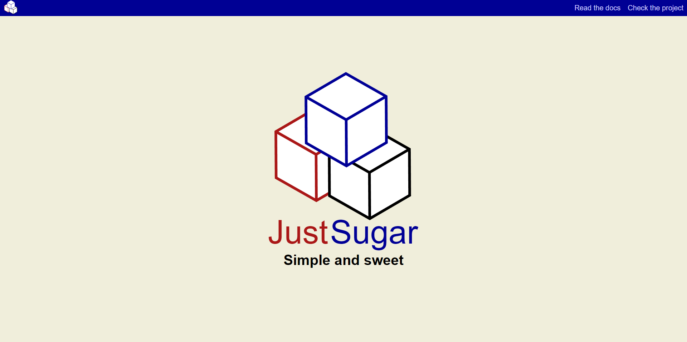

# Getting started with Just Sugar

## Just Sugar comes with a simple homepage already created, let's take a look at it.

```html
<!DOCTYPE html>
<html lang="en">

<head>
    <meta charset="UTF-8">
    <meta name="viewport" content="width=device-width, initial-scale=1.0">
    <title>Home</title>
</head>
<script type="module">
    import APP from "/core/app.js";
    new APP(null, {wrapperSelector: '#APP', devMode: true, layout: "default", view: "home"})
</script>
<body id="APP"></body>
</html>
```
As you can see we load the ```app.js``` file from our core directoty and then we create a new instance of the app, giving it the required parameters. That is about it! Everything else is handled automatically.

You may notice that we have an id of ```APP``` on the body element. This is because the body will be used as the wrapper of the application. The wrapper is used as a fixed reference point for all the logic of the application. It is where our interface will be rendered. Feel free to change the wrapper however you want. It can be a div, section, article or anything else you want.

## Let's take a look at an example using the built in router.

```html
<head>
    <meta charset="UTF-8">
    <meta name="viewport" content="width=device-width, initial-scale=1.0">
    <title>Home</title>
</head>
<script type="module">
    import APP from "/core/app.js";
    import routes from "/src/config/routes.js"
    new APP(routes, {wrapperSelector: '#APP', devMode: true})
</script>
<body id="APP"></body>
</html>
```
As you can see we import the routes from ```/src/config/``` and we pass them to out app as the first parameter. Now each time we access an URL or the URL changes Just Sugar will analyze it and load the appropiate layout and view.

The second parameter sent to the APP class are settings. We tell the app what wrapper to look for and whether or not it should start in developement mode. As of yet the only difference between developement mode is how errors are handled but we will look at those later.

## Now we are ready to start the show!

We had a very quick look at how the application get's loaded so let's see it in action now.

Just sugar comes with a simple server that can be used for developement. This server routes everything to the ```index.html``` file except for request for files (css, js, jpg, etc).

In order to start the server you can run ```node server.js``` from the framework's root directory.

You can access the app by going to ```http://localhost:3000/```

And here we have it!



## What's next?

In the [next](ViewCreation.md) step of the tutorial we will create a view.

