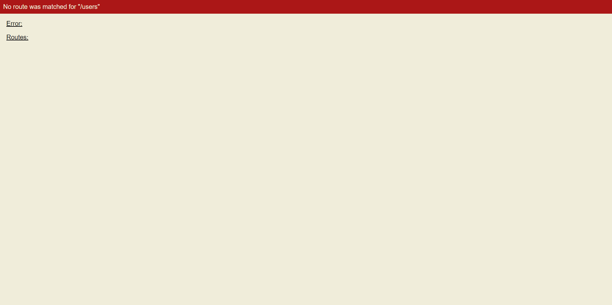

# Creating a view in Just Sugar

In the [previous step](Start.md) we had a quick look at the index file where the application is loaded by default. In this step we will create a simple view, containing a list of users.

This example will not reflect reality as the data displayed in the view is just a mockup meant to simulate a real data set.

Let's get started!

## Routing
The first thing we need to do is create a route for out new view. When adding routes you can call them whatever you want but for this example we will keep things simple and call it ```/users```.

Before we add the route let's try accessing this URL and see what happens. Go to ```http://localhost:3000/users``` and you will be met with an error page.



If you click on "Routes" you will see that we currently have only one route, the one for the first page.

If you click on "Error" you will be able to see the details of the error.